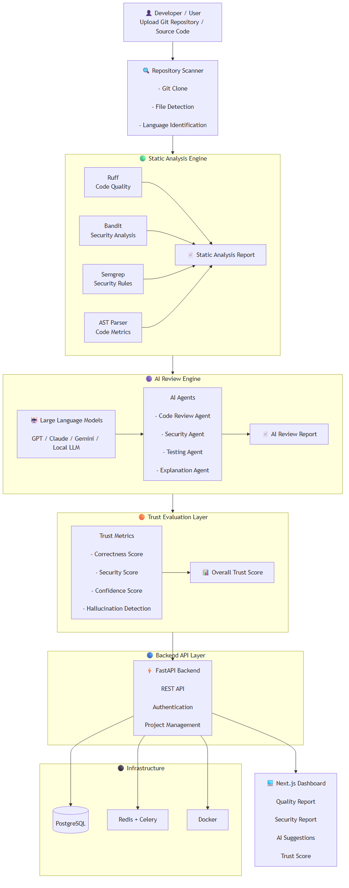
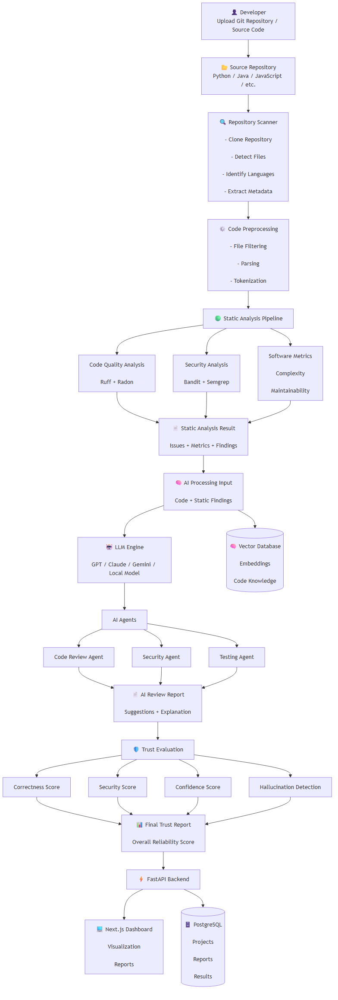
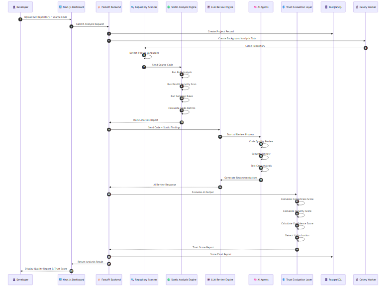

# 🤖 Trustworthy AI Code Review Assistant

<p align="center">


</p>


<p align="center">

🚧 <b>Status:</b> Active Development |
🎯 <b>Version:</b> MVP v0.1 |
🔬 <b>Research Area:</b> AI for Software Engineering (AI4SE)

</p>


<h3 align="center">

An Open-Source Platform for Trustworthy AI-assisted Code Review and Software Quality Analysis

</h3>


---

## 🌟 Overview

Trustworthy AI Code Review Assistant is an open-source platform that combines:

- Static Code Analysis
- Large Language Models (LLMs)
- Software Quality Metrics
- Security Analysis
- Trust Evaluation

to provide reliable and explainable AI-assisted code review.


---

# 🎯 Objectives

The project aims to solve problems in current AI coding assistants:

- Incorrect suggestions
- Hallucinated explanations
- Security risks
- Lack of confidence measurement
- Limited explainability


---

# 🏗️ System Architecture





## Data Flow





## Sequence Diagram





More details:

```
architecture/
```

---

# ✨ Features


## 🔍 AI Code Review

- Repository scanning
- Code quality analysis
- AI-generated review
- Improvement suggestions


## 🔐 Security Analysis

Supported tools:

- Bandit
- Semgrep
- Static analyzers


## 🧠 AI Engine

Supported models:

- GPT
- Claude
- Gemini
- Local LLM


## 📊 Trust Evaluation

Measures:

- Confidence score
- Evidence validation
- Hallucination detection
- Recommendation reliability


---

# 🛠 Technology Stack


## Backend

```
Python
FastAPI
PostgreSQL
Redis
Celery
SQLAlchemy
```


## Frontend

```
Next.js
React
TypeScript
```


## AI / Research

```
LLM
LangChain
AI Agents
RAG
Machine Learning
```


## DevOps

```
Docker
GitHub Actions
Linux
```


---

# 💻 Requirements


```
Python >= 3.12
Node.js >= 20
PostgreSQL >= 16
Redis >= 7
Docker
```


---

# ⚙️ Installation


## Clone Repository


```bash
git clone https://github.com/faridahmed-devhub/trustworthy-ai-code-review-assistant.git

cd trustworthy-ai-code-review-assistant
```


## Python Environment


```bash
python -m venv venv
```


Activate:


Windows:

```bash
venv\Scripts\activate
```


Linux/Mac:

```bash
source venv/bin/activate
```


Install:


```bash
pip install -r requirements.txt
```


---

# ▶️ Run Backend


```bash
uvicorn app.main:app --reload
```


API:

```
http://localhost:8000/docs
```


---

# 📂 Project Structure


```text
trustworthy-ai-code-review-assistant/

├── backend/

├── frontend/

├── analysis_engine/

├── ai_engine/

├── architecture/
│
│   ├── diagrams/
│   ├── adr/
│   ├── research/
│   └── templates/


├── experiments/

├── datasets/

├── tests/

├── docker/

├── requirements.txt

└── README.md
```


---

# 📚 Documentation


Architecture documentation:

```
architecture/
```


Contains:

- System Architecture
- Component Design
- Deployment Design
- Database Design
- ADR Decisions
- Research Documentation


---

# 🔬 Research Area


Main focus:

```
AI for Software Engineering (AI4SE)
```


Research topics:

- Trustworthy AI
- Explainable AI
- AI Code Review
- Software Security
- Software Quality


---

# 🚀 Roadmap


## Phase 1

✅ Architecture Design

✅ Documentation


## Phase 2

⬜ Backend API

⬜ Database

⬜ Static Analysis


## Phase 3

⬜ LLM Integration

⬜ AI Agents


## Phase 4

⬜ Trust Evaluation

⬜ Benchmark System


## Phase 5

⬜ Dashboard


---

# 👨‍💻 Author


**Farid Ahmed**

Research Interests:

- Trustworthy AI
- AI Software Engineering
- Code Review Automation
- Software Security


---

# 📄 License


MIT License


---

# 🤝 Contributing


Contributions and suggestions are welcome.


---

# 🎯 Vision


Build AI software engineering assistants that are:


⭐ Reliable

🔒 Secure

🧠 Intelligent

📈 Evidence-based


<p align="center">

Built with ❤️ by <b>Farid Ahmed</b>

</p>